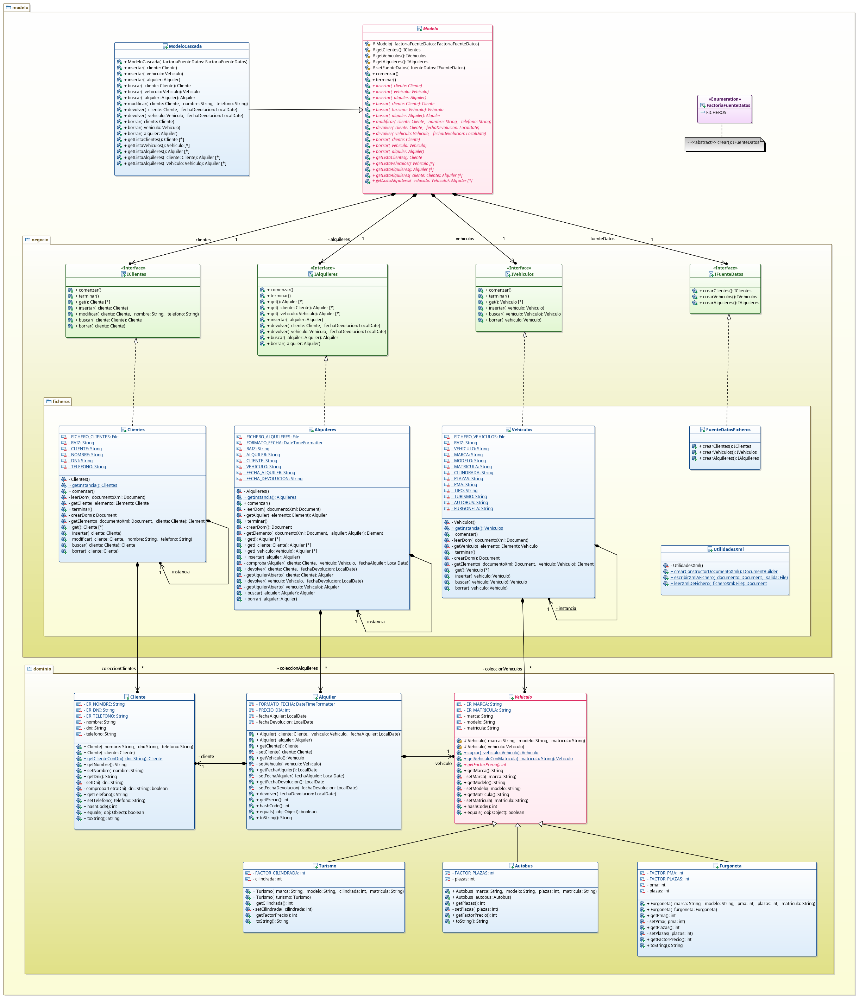

# Tarea: Alquiler de vehículos (v2)
## Profesor: José Ramón Jiménez Reyes
## Alumno:José Martínez Estrada

Al cliente le ha gustado bastante la aplicación, pero nos comenta que por favor añadamos persistencia a los datos introducidos, ya que tal y como está ahora la aplicación no es funcional. Por tanto, en este **tercer sprint** añadiremos persistencia a los datos utilizando para ello ficheros XML, para lo que sustituiremos el modelo que teníamos de memoria, por un modelo de ficheros. También aprovecharemos para modificar algún detalle del que nos hemos dado cuenta:

- Los métodos `getCantidad` de las interfaces de la capa de negocio y las clases que lo implementan no son necesarios, es más, ni siquiera los exponemos en nuestro modelo, por lo que los eliminaremos.
- En nuestro `Modelo` podemos realizar en el constructor lo que se realiza en el constructor de la implementación `ModeloCascada`, para que si luego tenemos más implementaciones no tengan que repetir dicho código.

Dado que nuestra aplicación la tenemos bien diseñada hasta el momento, sólo tendremos que modificar el modelo de la misma dejando todo lo anterior tal y como estaba.

Al **analizar** cómo **llevaremos a cabo la persistencia**, hemos decidido leer los ficheros al arrancar la aplicación, gestionarlos en memoria y almacenarlos en los mismos ficheros al cerrar la aplicación. Cada clase de la implementación de la capa `ficheros` leerá su fichero y lo almacenará en una lista tal y como se hacía en la versión de memoria. Pero con esto nos surge algún que otro problema:

- Los alquileres guardan una referencia del cliente y del vehículo, pero dicha clase no es capaz de comunicarse con las otras para poder buscar dichas referencias. Para solucionar este problema vamos a utilizar el **patrón singlenton**, con lo que sólo podremos tener una única instancia de cada clase de la capa de ficheros. Con esto conseguimos que no haya más de una instancia que pueda leer el fichero y posteriormente modificarlo, por lo que podremos acceder sin problemas desde los alquileres a los clientes y a los vehículos para buscar las referencias.
- Pero esto acarrea otro problema y es que estamos exponiendo dichas instancias a toda la aplicación, lo que podría permitir que desde cualquier lugar se pueda acceder a las mismas provocando efectos indeseados y rompiendo con el principio de ocultación de la información. Para solucionarlo jugaremos con las visibilidades. Haremos que los métodos que nos devuelven la instancia de cada clase (`getInstancia`) tengan una **visibilidad de paquete**, con lo que sólo podremos acceder a ellas desde el paquete `ficheros`. También tenemos que hacer que la factoría de fuente de datos sólo permita crearlas desde el mismo paquete para que sólo se puedan crear fuentes de datos desde la capa de modelo. Por último debemos modificar el constructor del `Modelo` para que no acepte una fuente de datos, sino el tipo de la fuente de datos y sea él el que la cree. Y finalmente modificaremos la clase `MainApp`, para que en vez de pasarle la fuente de datos, se le pase el tipo.

En este repositorio de GitHub hay un esqueleto de proyecto **gradle** con las dependencias necesarias del proyecto y que ya lleva incluidos todos los test necesarios que el programa debe pasar.

Para ello te muestro un diagrama de clases para la capa del modelo que es la única que varía y poco a poco te iré explicando los diferentes pasos a realizar:

#### Primeros Pasos
- Lo primero que debes hacer es un **fork** del repositorio donde he colocado el esqueleto de este proyecto.
- Clona tu repositorio remoto recién copiado en GitHub a un repositorio local.
- Modifica el archivo `README.md` para que incluya tu nombre en el apartado "Alumno".
- Copia los ficheros del directorio `src/main/java` de tu tarea anterior al repositorio local. Realiza tu **primer commit**.

#### Modificación de algunos detalles
- Refactoriza el modelo para que pasa a ser `ficheros` en vez de `memoria`, modificando todo lo que se indica en el diagrama de clases.
- Elimina los métodos `getCantidad` tanto de las interfaces de la capa negocio como de la nueva capa `ficheros`.
- Haz que el constructor de `Modelo` sea el que realice la asignación de la fuente de datos y que desde `ModeloCascada` se llame a este constructor.
- Realiza un **commit**.

#### Lectura / Escritura de ficheros XML
- Implementa el **patrón singlenton** en cada una de las clase de la capa ficheros tal y como se indica en el diagrama de clases.
- Cambia la visibilidad en el método `crear` en la clase `FactoriaFuenteDatos`.
- Cambia el constructor de `Modelo` (y, por consecuencia de `ModeloCascada`) para que acepte un tipo de factoría de fuente de datos y que la cree.
- Cambia la clase `MainApp` para que todo siga funcionando correctamente.
- Crea la clase `UtilidadesXML`  con los tres métodos que se indican en el diagrama.
- Modifica la clase `Clientes` del paquete `ficheros`, para que al comenzar lea el fichero XML de clientes, lo almacene en un una lista y al terminar lo vuelva a almacenar en dicho fichero. El fichero debe estar situado en la carpeta `datos` de la raíz del proyecto y se debe llamar `clientes.xml`. Se deben implementar los métodos que se especifican en el diagrama y que son autoexplicativos. La estructura del fichero será la siguiente:

~~~XML
	<?xml version="1.0" encoding="UTF-8" standalone="no"?>
	<clientes>
		<cliente dni="11223344B" nombre="Bob Esponja" telefono="950112233"/>
		<cliente dni="11111111H" nombre="Patricio Estrella" telefono="950111111"/>
	</clientes>
~~~

- Modifica la clase `Vehiculos` del paquete `ficheros`, para que al comenzar lea el fichero XML de vehículos, lo almacene en un una lista y al terminar lo vuelva a almacenar en dicho fichero. El fichero debe estar situado en la carpeta `datos` de la raíz del proyecto y se debe llamar `vehiculos.xml`. Se deben implementar los métodos que se especifican en el diagrama y que son autoexplicativos. La estructura del fichero será la siguiente:

~~~XML
    <?xml version="1.0" encoding="UTF-8" standalone="no"?>
    <vehiculos>
        <vehiculo marca="Scania" matricula="1234BCD" modelo="Citywide" plazas="60" tipo="autobus"/>
        <vehiculo cilindrada="1100" marca="Seat" matricula="1111BBB" modelo="León" tipo="turismo"/>
        <vehiculo cilindrada="1300" marca="Renault" matricula="2222CCC" modelo="Megane" tipo="turismo"/>
        <vehiculo marca="Mercedes-Benz" matricula="3333DDD" modelo="eSprinter" plazas="2" pma="7000" tipo="furgoneta"/>
    </vehiculos>
~~~

- Modifica la clase `Alquileres` del paquete `ficheros`, para que al comenzar lea el fichero XML de alquileres, lo almacene en un una lista y al terminar lo vuelva a almacenar en dicho fichero. El fichero debe estar situado en la carpeta `datos` de la raíz del proyecto y se debe llamar `alquileres.xml`. Se deben implementar los métodos que se especifican en el diagrama y que son autoexplicativos. Se deben acceder a las diferentes instancias para buscar las referencias necesarias para insertar en la lista al leer el fichero. La estructura del fichero será la siguiente:

~~~XML
    <?xml version="1.0" encoding="UTF-8" standalone="no"?>
    <alquileres>
        <alquiler cliente="11223344B" fechaAlquiler="01/03/2023" fechaDevolucion="07/03/2023" vehiculo="3333DDD"/>
        <alquiler cliente="11111111H" fechaAlquiler="10/03/2023" fechaDevolucion="14/03/2023" vehiculo="1111BBB"/>
        <alquiler cliente="11223344B" fechaAlquiler="10/03/2023" fechaDevolucion="16/03/2023" vehiculo="1234BCD"/>
        <alquiler cliente="11111111H" fechaAlquiler="15/03/2023" vehiculo="2222CCC"/>
    </alquileres>
~~~

- Comprueba que las clases **pasan los test**, que **todo sigue funcionando igual** y, cuando lo haga, realiza un **commit** y seguidamente un **push** a tu repositorio remoto.

#### Se valorará:

- La indentación debe ser correcta en cada uno de los apartados.
- El nombre de las variables debe ser adecuado.
- Se debe utilizar la clase `Entrada` para realizar la entrada por teclado.
- El programa debe pasar todas las pruebas que van en el esqueleto del proyecto y toda entrada del programa será validada, para evitar que el programa termine abruptamente debido a una excepción. Además, que ni decir tiene, el programa no debe contener ningún error léxico, sintáctico, de dependencias, etc.
- La corrección ortográfica tanto en los comentarios como en los mensajes que se muestren al usuario.
